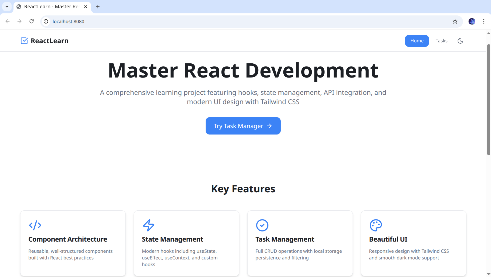
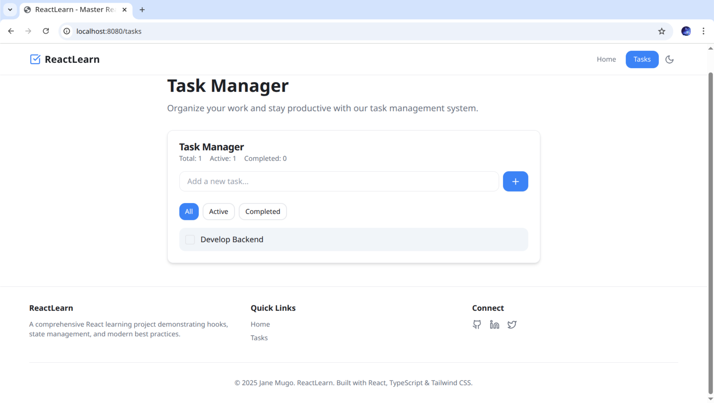

# Vite React + Tailwind Project

This project is a responsive React application built with **Vite**and **Tailwind CSS**components.  
It demonstrates reusable component architecture, state management with React hooks, API integration using **TanStack React Query**, and modern UI patterns with Radix primitives.

##  Tech Stack

- **React 18** with TSX
- **Vite 5** (fast bundler & dev server)
- **Tailwind CSS 3** (utility-first styling)
- **React Router v6** (routing)
- **TypeScript 5** (type safety)

- Additional libraries:
  - `lucide-react` (icons)
  - `date-fns` (date utilities)
 

---

## Project Structure
src/
├── components/       # Reusable UI components
├── pages/           # Page components
├── hooks/           # Custom React hooks
├── context/         # React context providers
├── api/             # API integration functions
├── utils/           # Utility functions
└── App.jsx  

## Install dependencies
npm install

## Start development server
npm run dev

## Screenshots

## Live Deployment
Explore the live version on Vercel: [mern-week-3-czzt.vercel.app](https://mern-week-3-czzt.vercel.app)

## Developer
Developed by Jane Mugo
